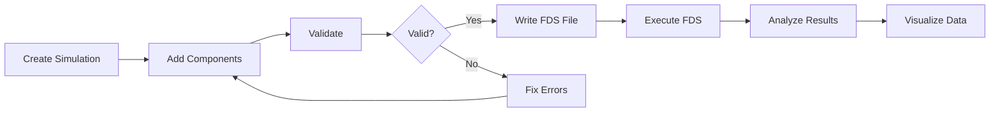

# Getting Started with PyFDS

Welcome to PyFDS! This guide will help you get up and running with creating, executing, and analyzing FDS fire simulations using Python.

## What You'll Learn

-   :material-download: **Installation**

    ---

    Set up PyFDS and its dependencies on your system

    [:octicons-arrow-right-24: Installation Guide](installation.md)

-   :material-rocket-launch: **Quick Start**

    ---

    Create your first fire simulation in minutes

    [:octicons-arrow-right-24: Quick Start Tutorial](quickstart.md)

-   :material-lightbulb: **Key Concepts**

    ---

    Understand the fundamentals of PyFDS and FDS

    [:octicons-arrow-right-24: Key Concepts](concepts.md)

## Prerequisites

Before you begin, you should have:

- **Python 3.11 or higher** installed on your system
- **Basic Python knowledge** (variables, functions, classes)
- **Optional**: FDS installed if you want to execute simulations

!!! tip "New to Python?"
    If you're new to Python, we recommend completing a basic Python tutorial first. Good resources include:

    - [Python.org Official Tutorial](https://docs.python.org/3/tutorial/)
    - [Real Python Tutorials](https://realpython.com/)

## Typical Workflow

Here's what a typical PyFDS workflow looks like:

1. **Create** a simulation object with metadata
2. **Add** components (mesh, geometry, fires, devices)
3. **Validate** the configuration
4. **Write** the FDS input file
5. **Execute** the simulation (optional)
6. **Analyze** the results (optional)
7. **Visualize** the data (optional)

## Learning Path

We recommend following this learning path:

### :material-numeric-1-circle: Start Here
Begin with [Installation](installation.md) to set up PyFDS on your system.

### :material-numeric-2-circle: Build Your First Simulation
Follow the [Quick Start Tutorial](quickstart.md) to create a simple room fire simulation.

### :material-numeric-3-circle: Understand the Basics
Read [Key Concepts](concepts.md) to understand FDS fundamentals and PyFDS architecture.

### :material-numeric-4-circle: Explore Features
Dive into the [User Guide](../guide/index.md) to learn about specific features and capabilities.

### :material-numeric-5-circle: Learn from Examples
Study the [Examples](../examples/index.md) to see real-world applications.

### :material-numeric-6-circle: Reference Documentation
Use the [API Reference](../api/index.md) when you need detailed information about specific classes and methods.

## Quick Links

| Resource | Description |
|----------|-------------|
| [Installation](installation.md) | Install PyFDS and dependencies |
| [Quick Start](quickstart.md) | Your first simulation in 5 minutes |
| [Key Concepts](concepts.md) | Understanding PyFDS fundamentals |
| [User Guide](../guide/index.md) | Comprehensive feature documentation |
| [Examples](../examples/index.md) | Real-world code examples |
| [FAQ](../reference/faq.md) | Frequently asked questions |
| [Troubleshooting](../reference/troubleshooting.md) | Common issues and solutions |

## Getting Help

If you get stuck, here's where to find help:

- :material-file-document: Check the [FAQ](../reference/faq.md) for common questions
- :material-bug: Review the [Troubleshooting Guide](../reference/troubleshooting.md)
- :fontawesome-brands-github: Search [GitHub Issues](https://github.com/GraysonBellamy/pyfds/issues)
- :material-forum: Ask in [GitHub Discussions](https://github.com/GraysonBellamy/pyfds/discussions)

---

Ready to begin? Let's [install PyFDS](installation.md)!
