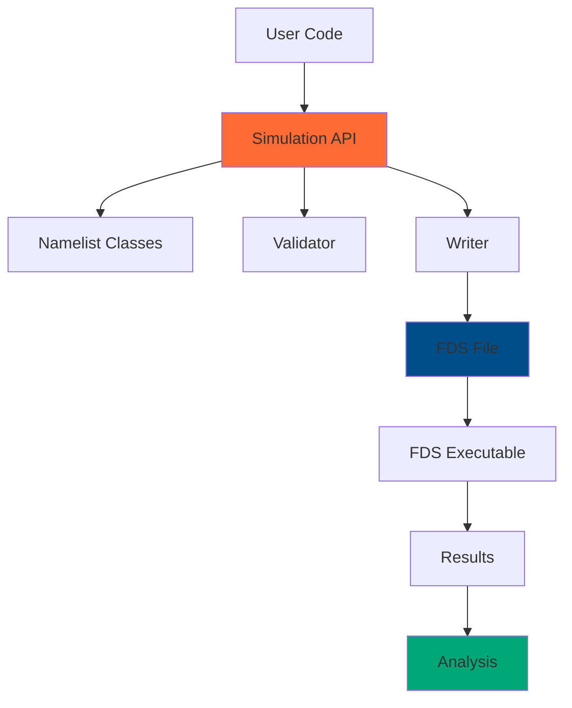
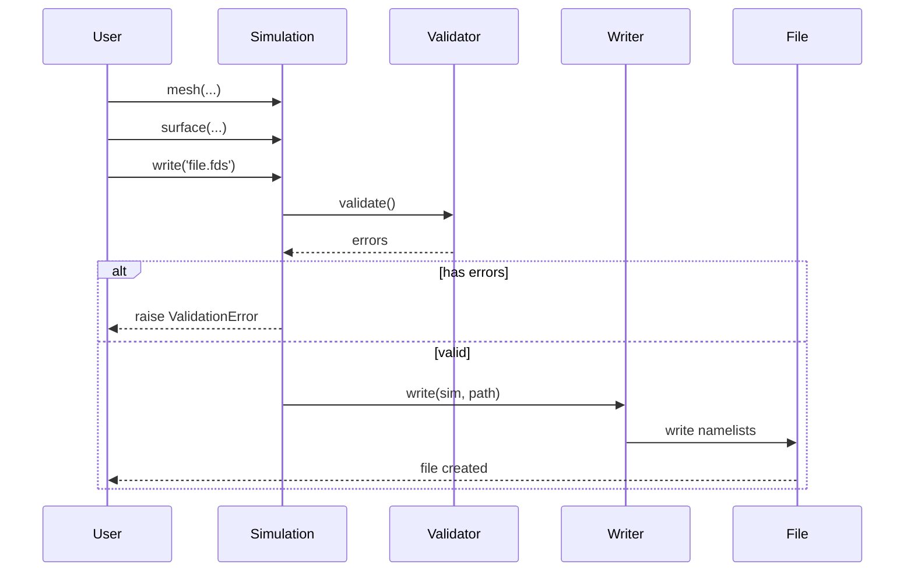
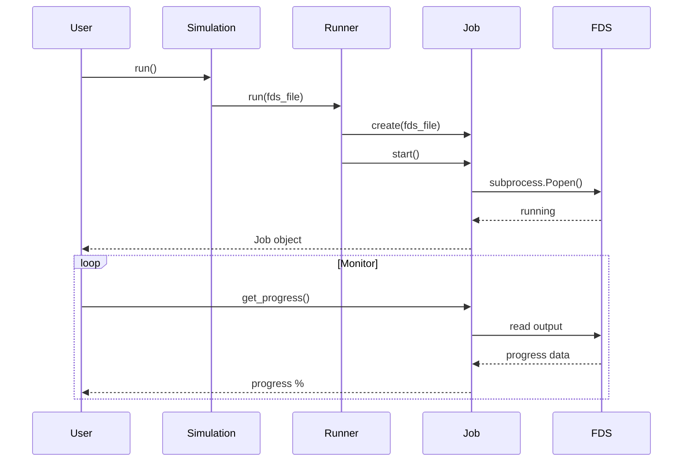
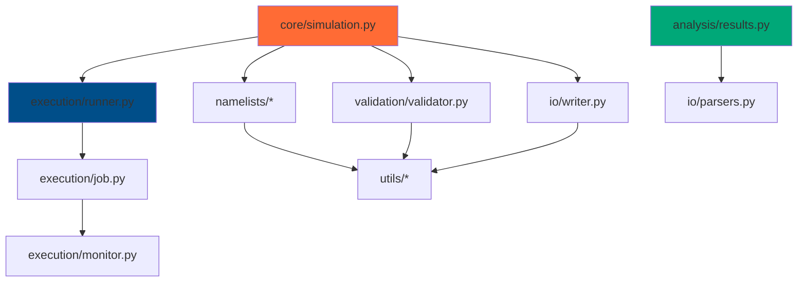

# Architecture

PyFDS code organization and design patterns.

## Overview

PyFDS is organized into modular components with clear separation of concerns:



## Project Structure

```
pyfds/
├── src/pyfds/           # Source code
│   ├── core/            # Core simulation classes
│   │   ├── managers/    # Specialized manager classes
│   │   │   ├── geometry.py     # GeometryManager (meshes, obstructions, vents)
│   │   │   ├── material.py     # MaterialManager (materials, surfaces)
│   │   │   ├── ramp.py         # RampManager (time-varying functions)
│   │   │   ├── physics.py      # PhysicsManager (reactions, misc)
│   │   │   ├── instrumentation.py  # InstrumentationManager (devices, props)
│   │   │   ├── control.py      # ControlManager (controls, initial conditions)
│   │   │   └── output.py       # OutputManager (FDS file generation)
│   │   ├── namelists/   # FDS namelist implementations
│   │   ├── simulation.py    # Simulation orchestrator
│   │   └── validator.py     # Validation logic
│   ├── execution/       # Running and monitoring
│   ├── analysis/        # Results processing
│   ├── builders/        # High-level builders
│   ├── io/              # File I/O
│   └── utils/           # Utilities
├── tests/               # Test suite
├── docs/                # Documentation
├── examples/            # Example scripts
└── pyproject.toml       # Project configuration
```

## Core Components

### Simulation Class

Central orchestration class for building FDS files using specialized managers.

**Location**: `src/pyfds/core/simulation.py`

**Responsibilities**:

- Coordinate specialized managers for different simulation aspects
- Provide fluent API for namelist creation
- Delegate to managers for storage and validation
- Write FDS files via OutputManager
- Coordinate execution

**Design Pattern**: Facade pattern with manager delegation + Builder pattern for fluent API

```python
class Simulation:
    """Main class for building FDS simulations."""

    def __init__(self, chid: str, title: str | None = None):
        self.head = Head(chid=chid, title=title)

        # Initialize specialized managers
        self._geometry = GeometryManager()        # Meshes, obstructions, vents
        self._material_mgr = MaterialManager()    # Materials, surfaces
        self._ramps = RampManager()               # Time-varying functions
        self._physics = PhysicsManager()          # Reactions, misc params
        self._instrumentation = InstrumentationManager()  # Devices, props
        self._controls = ControlManager()         # Controls, initial conditions

    def mesh(self, **kwargs) -> "Simulation":
        """Add MESH namelist (delegates to GeometryManager)."""
        mesh = Mesh(**kwargs)
        self._geometry.add_mesh(mesh)
        return self  # Enable chaining

    # Access managers directly for advanced usage
    @property
    def geometry(self) -> GeometryManager:
        """Access geometry manager."""
        return self._geometry

    @property
    def ramps(self) -> RampManager:
        """Access ramp manager."""
        return self._ramps

    def write(self, path: str) -> None:
        \"\"\"Write to FDS file via OutputManager.\"\"\"
        self.validate()
        output = OutputManager(
            self._geometry, self._material_mgr, self._physics,
            self._instrumentation, self._controls, self._ramps,
            self.head, self.time_config
        )
        output.write(path, output.to_fds())
```

### Namelist Hierarchy

**Location**: `src/pyfds/core/namelists/`

All namelists inherit from base class in separate, focused modules:

```python
# Base class (base.py)
class NamelistBase(BaseModel):
    """Base class for all FDS namelists."""

    def to_fds(self) -> str:
        """Convert to FDS namelist format."""
        raise NotImplementedError

# Concrete implementation (mesh.py)
class Mesh(NamelistBase):
    """MESH namelist."""

    ijk: tuple[int, int, int]
    xb: tuple[float, float, float, float, float, float]
    id: str | None = None

    def to_fds(self) -> str:
        return f"&MESH IJK={self.ijk[0]},{self.ijk[1]},{self.ijk[2]}, XB={','.join(map(str, self.xb))} /"
```

**Namelist Modules**:

- `base.py` - NamelistBase abstract class
- `head.py` - HEAD namelist (simulation metadata)
- `time.py` - TIME namelist (time control)
- `mesh.py` - MESH namelist (computational domain)
- `surf.py` - SURF namelist (surface properties)
- `obst.py` - OBST namelist (obstructions)
- `devc.py` - DEVC namelist (devices)
- `vent.py` - VENT namelist (vents and boundaries)
- `ramp.py` - RAMP namelist (time-dependent functions)
- `matl.py` - MATL namelist (materials)
- `reac.py` - REAC namelist (reactions)
- `prop.py` - PROP namelist (device properties)
- `ctrl.py` - CTRL namelist (control logic)
- `init.py` - INIT namelist (initial conditions)
- `misc.py` - MISC namelist (miscellaneous parameters)

**Design Pattern**: Template method pattern with Pydantic validation

### Manager Architecture

**Location**: `src/pyfds/core/managers/`

Simulation logic is organized into specialized managers following the **Single Responsibility Principle**:

```python
# Base manager class
class BaseManager:
    """Base class for all managers."""

    def validate(self) -> list[str]:
        """Validate manager state."""
        raise NotImplementedError

# Specialized managers
class GeometryManager(BaseManager):
    """Manages meshes, obstructions, and vents."""

    def __init__(self):
        self._meshes: list[Mesh] = []
        self._obstructions: list[Obstruction] = []
        self._vents: list[Vent] = []

    @property
    def meshes(self) -> list[Mesh]:
        return self._meshes

    def add_mesh(self, mesh: Mesh) -> None:
        self._meshes.append(mesh)

    def validate(self) -> list[str]:
        """Check mesh aspect ratios, etc."""
        warnings = []
        for mesh in self._meshes:
            # Validation logic
            ...
        return warnings

class MaterialManager(BaseManager):
    """Manages materials and surfaces."""
    # Materials, surfaces

class RampManager(BaseManager):
    """Manages time-varying and property-varying ramps."""
    # RAMPs are cross-cutting: used by materials, surfaces, vents, controls

class PhysicsManager(BaseManager):
    """Manages reactions and misc parameters."""

class InstrumentationManager(BaseManager):
    """Manages devices and props."""

class ControlManager(BaseManager):
    """Manages controls and initial conditions."""

class OutputManager(BaseManager):
    """Generates FDS input files from all managers."""

    def to_fds(self) -> str:
        """Generate complete FDS file content."""
        # Combines all manager data in proper FDS order
```

**Manager Benefits**:

- **Separation of Concerns**: Each manager handles one domain
- **Easier Testing**: Test managers in isolation
- **Better Validation**: Manager-specific validation logic
- **Cleaner API**: Access via `sim.geometry.meshes` or `sim.ramps.ramps`
- **Scalability**: Easy to add new managers for new FDS features

**API Patterns**:

```python
# Convenience methods (delegated to managers)
sim.add(Mesh(...))        # Delegates to geometry manager
sim.add_ramp(...)    # Delegates to ramp manager

# Direct manager access (advanced usage)
sim.geometry.meshes           # List of all meshes
sim.ramps.ramps              # List of all ramps
sim.material_mgr.surfaces    # List of all surfaces

# Manager validation
warnings = sim.geometry.validate()  # Geometry-specific checks
warnings = sim.ramps.validate()     # Check for duplicate RAMP IDs
```

### Validation System

**Location**: `src/pyfds/core/validator.py`

Validates simulations before writing:

```python
class Validator:
    """Validates simulation configuration."""

    def validate(self, sim: Simulation) -> list[ValidationError]:
        """Run all validation checks."""
        errors = []
        errors.extend(self._check_required())
        errors.extend(self._check_references())
        errors.extend(self._check_geometry())
        errors.extend(self._check_mesh_quality())
        return errors
```

**Design Pattern**: Strategy pattern for validation rules

### Execution System

**Location**: `src/pyfds/execution/`

Manages FDS process execution:

```python
class FDSRunner:
    """Execute FDS simulations."""

    def run(
        self,
        fds_file: str,
        n_threads: int = 1,
        wait: bool = True
    ) -> Job:
        """Run FDS simulation."""
        job = Job(fds_file, n_threads)
        job.start()

        if wait:
            job.wait()

        return job
```

**Design Pattern**: Command pattern with job objects

## Design Patterns

### Builder Pattern

Used for `Simulation` class to construct complex FDS files incrementally:

```python
sim = (Simulation(chid='fire')
    .add(Time(t_end=600.0))
    .add(Mesh(ijk=Grid3D.of(50, 50, 25), xb=Bounds3D.of(0, 5, 0, 5, 0, 2.5)))
    .add(Surface(id='FIRE', hrrpua=1000.0))
    .add(Obstruction(xb=Bounds3D.of(2, 3, 2, 3, 0, 0.1), surf_id='FIRE')))
```

**Benefits**:

- Fluent, readable API
- Step-by-step configuration
- Immutable intermediate states

### Factory Pattern

Used for creating specialized namelists:

```python
class NamelistFactory:
    """Create namelists from parameters."""

    @staticmethod
    def create(name: str, **kwargs) -> Namelist:
        """Factory method for namelists."""
        if name == 'MESH':
            return Mesh(**kwargs)
        elif name == 'SURF':
            return Surface(**kwargs)
        # ... etc
```

### Strategy Pattern

Used for validation rules:

```python
class ValidationRule(Protocol):
    """Validation rule interface."""

    def check(self, sim: Simulation) -> list[str]:
        """Check simulation."""
        ...

class MeshResolutionRule:
    """Check mesh resolution."""

    def check(self, sim: Simulation) -> list[str]:
        errors = []
        for mesh in sim.geometry.meshes:
            if self._is_too_coarse(mesh):
                errors.append(f"Mesh {mesh.id} too coarse")
        return errors
```

### Observer Pattern

Used for monitoring job progress:

```python
class Job:
    """Running FDS job."""

    def __init__(self):
        self._callbacks: list[Callable] = []

    def add_callback(self, callback: Callable):
        """Register progress callback."""
        self._callbacks.append(callback)

    def _notify_progress(self, progress: float):
        """Notify all observers."""
        for callback in self._callbacks:
            callback(self, progress)
```

## Data Flow

### Writing FDS Files



### Running Simulations



## Module Dependencies



## Extension Points

### Custom Namelists

Add new namelist types by extending `Namelist`:

```python
from pyfds.namelists import Namelist

class CustomNamelist(Namelist):
    """Custom namelist."""

    param1: float
    param2: str

    def to_fds(self) -> str:
        return f"&CUSTOM PARAM1={self.param1}, PARAM2='{self.param2}' /"

# Use in Simulation
class Simulation:
    def custom(self, **kwargs) -> "Simulation":
        """Add custom namelist."""
        nl = CustomNamelist(**kwargs)
        self._namelists.append(nl)
        return self
```

### Custom Validators

Add validation rules:

```python
from pyfds.validation import Validator, ValidationRule

class MyValidator(Validator):
    """Custom validator."""

    def __init__(self):
        super().__init__()
        self.add_rule(MyCustomRule())

class MyCustomRule(ValidationRule):
    """Custom validation rule."""

    def check(self, sim: Simulation) -> list[str]:
        # Custom validation logic
        return errors
```

### Custom Parsers

Parse additional FDS output files:

```python
from pyfds.io import Parser

class CustomParser(Parser):
    """Parse custom FDS output."""

    def parse(self, file_path: str) -> pl.DataFrame:
        """Parse file and return DataFrame."""
        # Custom parsing logic
        return data
```

## Testing Strategy

### Unit Tests

Test individual components in isolation:

```python
# tests/test_mesh.py
def test_mesh_creation():
    """Test MESH namelist creation."""
    mesh = Mesh(
        ijk=Grid3D.of(50, 50, 25),
        xb=Bounds3D.of(0, 5, 0, 5, 0, 2.5)
    )
    assert mesh.ijk == (50, 50, 25)

def test_mesh_to_fds():
    """Test FDS output format."""
    mesh = Mesh(ijk=Grid3D.of(10, 10, 10), xb=Bounds3D.of(0, 1, 0, 1, 0, 1))
    fds_str = mesh.to_fds()
    assert '&MESH' in fds_str
    assert 'IJK=10,10,10' in fds_str
```

### Integration Tests

Test component interactions:

```python
# tests/test_simulation.py
def test_simulation_write():
    """Test writing complete simulation."""
    sim = Simulation(chid='test')
    sim.add(Time(t_end=600.0))
    sim.add(Mesh(ijk=Grid3D.of(50, 50, 25), xb=Bounds3D.of(0, 5, 0, 5, 0, 2.5)))

    sim.write('test.fds')

    # Verify file contents
    with open('test.fds') as f:
        content = f.read()
        assert '&HEAD' in content
        assert '&TIME' in content
        assert '&MESH' in content
```

### End-to-End Tests

Test full workflows:

```python
# tests/test_e2e.py
def test_full_workflow():
    """Test complete simulation workflow."""
    # Create
    sim = create_room_fire()

    # Validate
    assert sim.is_valid()

    # Write
    sim.write('room_fire.fds')

    # Run (if FDS available)
    if fds_available():
        job = sim.run(wait=True)
        assert job.is_complete()

        # Analyze
        results = FDSResults('room_fire')
        temp = results.get_device('TEMP')
        assert len(temp) > 0
```

## Performance Considerations

### Lazy Evaluation

Namelists aren't converted to strings until writing:

```python
# This is fast - just stores objects
sim.add(Mesh(ijk=Grid3D.of(50, 50, 25), xb=Bounds3D.of(0, 5, 0, 5, 0, 2.5)))

# This triggers conversion
sim.write('test.fds')  # to_fds() called here
```

### Efficient Validation

Validation is deferred until needed:

```python
# No validation yet
sim = Simulation(chid='test')
sim.add(Mesh(...))

# Validate only when requested
sim.validate()  # or
sim.write()  # validates automatically
```

### Memory Management

Results use Polars for efficient data handling:

```python
# Polars is faster than pandas for large datasets
results = FDSResults('sim')
temp = results.get_device('TEMP')  # Returns pl.DataFrame

# Filter without loading everything
filtered = temp.filter(pl.col('Time') > 100)
```

## Best Practices

### Immutability

Namelists are immutable after creation (Pydantic frozen models):

```python
mesh = Mesh(ijk=Grid3D.of(50, 50, 25), xb=Bounds3D.of(0, 5, 0, 5, 0, 2.5))
# mesh.ijk = (100, 100, 50)  # Error: frozen model
```

### Type Safety

Use Pydantic for runtime type checking:

```python
class Mesh(BaseModel):
    ijk: tuple[int, int, int]  # Type enforced
    xb: tuple[float, ...]  # Variable length tuple

# This raises ValidationError
mesh = Mesh(ijk="50,50,25", xb=Bounds3D.of(0, 5, 0, 5, 0, 2.5))
```

### Clear Error Messages

Provide helpful error messages:

```python
def validate_mesh_bounds(xb):
    """Validate mesh bounds."""
    if xb[1] <= xb[0]:
        raise ValueError(
            f"Invalid mesh bounds: x1 ({xb[1]}) must be > x0 ({xb[0]})"
        )
```

## See Also

- [Contributing](contributing.md) - Development guide
- [Testing](testing.md) - Test framework
- [API Reference](../api/index.md) - Code documentation

---

[Testing →](testing.md){ .md-button .md-button--primary }
