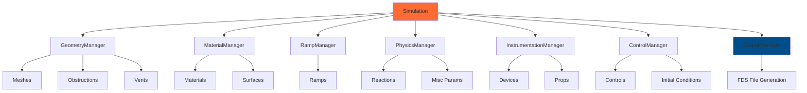

# Manager Architecture

PyFDS uses a **manager-based architecture** to organize simulation components following the **Single Responsibility Principle**. This design makes the codebase more maintainable, testable, and easier to extend.

## Overview

Instead of storing all simulation data in a single monolithic `Simulation` class, PyFDS delegates responsibilities to specialized manager classes:



## The Managers

### GeometryManager

**Location**: `src/pyfds/core/managers/geometry.py`

Manages geometric components of the simulation.

**Responsibilities**:
- Store and manage meshes (`MESH`)
- Store and manage obstructions (`OBST`)
- Store and manage vents (`VENT`)
- Validate mesh quality (aspect ratios, resolution)

**API**:
```python
# Access via Simulation
sim.geometry.meshes           # List of all meshes
sim.geometry.obstructions     # List of all obstructions
sim.geometry.vents            # List of all vents

# Add components (advanced usage)
sim.geometry.add_mesh(mesh)
sim.geometry.add_obstruction(obst)
sim.geometry.add_vent(vent)

# Validation
warnings = sim.geometry.validate()
```

**Example**:
```python
from pyfds import Simulation
from pyfds.core.namelists import Mesh

sim = Simulation(chid='test')

# Convenience method (recommended)
sim.add(Mesh(ijk=Grid3D.of(50, 50, 25), xb=Bounds3D.of(0, 5, 0, 5, 0, 2.5)))

# Direct manager access (advanced)
mesh = Mesh(ijk=Grid3D.of(100, 100, 50), xb=Bounds3D.of(0, 10, 0, 10, 0, 5))
sim.geometry.add_mesh(mesh)

# Inspect
print(f"Total meshes: {len(sim.geometry.meshes)}")
```

---

### MaterialManager

**Location**: `src/pyfds/core/managers/material.py`

Manages material-related components.

**Responsibilities**:
- Store and manage materials (`MATL`)
- Store and manage surfaces (`SURF`)
- Validate surface ID references

**API**:
```python
# Access via Simulation
sim.material_mgr.materials    # List of all materials
sim.material_mgr.surfaces     # List of all surfaces

# Add components
sim.material_mgr.add_material(material)
sim.material_mgr.add_surface(surface)

# Validation
warnings = sim.material_mgr.validate()
surface_warnings = sim.material_mgr.validate_surface_references(referenced_ids)
```

**Example**:
```python
# Create fire surface
sim.add(Surface(id='FIRE', hrrpua=1000.0, color='RED'))

# Check all surfaces
for surf in sim.material_mgr.surfaces:
    print(f"Surface: {surf.id}, HRRPUA: {surf.hrrpua}")
```

---

### RampManager

**Location**: `src/pyfds/core/managers/ramp.py`

Manages time-varying and property-varying ramps.

**Responsibilities**:
- Store and manage ramps (`RAMP`)
- Validate for duplicate ramp IDs
- Validate that referenced ramps exist

**Why Separate?**
RAMPs are **cross-cutting entities** used by multiple namelists:
- Materials (conductivity_ramp, specific_heat_ramp)
- Surfaces (ramp_q for HRR, ramp_t for temperature)
- Vents (ramp_v for flow rates)
- Controls (time-based setpoints)

**API**:
```python
# Access via Simulation
sim.ramps.ramps               # List of all ramps

# Add ramps
sim.ramps.add_ramp(ramp)
# Or use convenience method
sim.add_ramp(ramp)

# Validation
warnings = sim.ramps.validate()
ref_warnings = sim.ramps.validate_ramp_references(referenced_ids)
```

**Example**:
```python
from pyfds.core.namelists import Ramp, Material, Surface

# Time-based HRR ramp
hrr_ramp = Ramp(
    id="FIRE_RAMP",
    points=[(0, 0), (30, 100), (60, 500), (120, 1000)]
)
sim.add_ramp(hrr_ramp)

# Temperature-dependent conductivity ramp
k_ramp = Ramp(
    id="STEEL_K",
    points=[(20, 54.0), (200, 48.0), (400, 40.0), (800, 27.0)]
)
sim.add_ramp(k_ramp)

# Use in materials/surfaces
steel = Material(
    id="STEEL",
    density=7850.0,
    conductivity_ramp="STEEL_K",  # References k_ramp
    specific_heat=0.46
)
sim.add_material(steel)

fire_surf = Surface(
    id="BURNER",
    hrrpua=500.0,
    ramp_q="FIRE_RAMP"  # References hrr_ramp
)
sim.add_surface(fire_surf)

# Inspect all ramps
print(f"Total ramps: {len(sim.ramps.ramps)}")
```

---

### PhysicsManager

**Location**: `src/pyfds/core/managers/physics.py`

Manages physical simulation parameters.

**Responsibilities**:
- Store and manage reactions (`REAC`)
- Store and manage miscellaneous parameters (`MISC`)

**API**:
```python
# Access via Simulation
sim.physics.reactions         # List of all reactions
sim.physics.misc_params       # MISC namelist object

# Add components
sim.physics.add_reaction(reaction)
sim.physics.set_misc(misc)

# Validation
warnings = sim.physics.validate()
```

---

### InstrumentationManager

**Location**: `src/pyfds/core/managers/instrumentation.py`

Manages measurement devices and properties.

**Responsibilities**:
- Store and manage devices (`DEVC`)
- Store and manage props (`PROP`)
- Validate device ID uniqueness

**API**:
```python
# Access via Simulation
sim.instrumentation.devices   # List of all devices
sim.instrumentation.props     # List of all props

# Add components
sim.instrumentation.add_device(device)
sim.instrumentation.add_prop(prop)

# Validation
warnings = sim.instrumentation.validate()
```

**Example**:
```python
# Add temperature sensor
sim.add(Device(id='TEMP_1', quantity='TEMPERATURE', xyz=Point3D.of(2.5, 2.5, 2.0)))

# Check all devices
for dev in sim.instrumentation.devices:
    print(f"Device: {dev.id}, Quantity: {dev.quantity}")
```

---

### ControlManager

**Location**: `src/pyfds/core/managers/control.py`

Manages control logic and initial conditions.

**Responsibilities**:
- Store and manage controls (`CTRL`)
- Store and manage initial conditions (`INIT`)

**API**:
```python
# Access via Simulation
sim.controls.ctrls            # List of all controls
sim.controls.inits            # List of all initial conditions

# Add components
sim.controls.add_ctrl(ctrl)
sim.controls.add_init(init)

# Validation
warnings = sim.controls.validate()
```

---

### OutputManager

**Location**: `src/pyfds/core/managers/output.py`

Generates FDS input files from all managers.

**Responsibilities**:
- Combine all manager data
- Generate FDS file in proper namelist order
- Write files to disk

**Why Proper Ordering Matters**:
FDS requires namelists in specific order (e.g., RAMP before MATL that references it).

**API**:
```python
# Create output manager (done internally by Simulation)
output = OutputManager(
    geometry=sim.geometry,
    material_mgr=sim.material_mgr,
    physics=sim.physics,
    instrumentation=sim.instrumentation,
    controls=sim.controls,
    ramps=sim.ramps,
    head=sim.head,
    time_config=sim.time_config
)

# Generate FDS content
fds_content = output.to_fds()

# Write to file
output.write('simulation.fds', fds_content)
```

**Namelist Order**:
1. HEAD
2. TIME
3. MISC (if present)
4. MESH
5. **RAMP** (before MATL that references them)
6. REAC
7. MATL
8. SURF
9. PROP
10. OBST
11. VENT
12. CTRL
13. DEVC
14. INIT
15. TAIL

---

## Usage Patterns

### Convenience Methods (Recommended)

For most use cases, use the convenience methods on `Simulation`:

```python
sim = Simulation(chid='fire')
sim.add(Time(t_end=600.0))
sim.add(Mesh(ijk=Grid3D.of(50, 50, 25), xb=Bounds3D.of(0, 5, 0, 5, 0, 2.5)))
sim.add(Surface(id='FIRE', hrrpua=1000.0))
sim.add_ramp(ramp)
```

These methods:
- Are fluent (return `self` for chaining)
- Delegate to the appropriate manager
- Are the most Pythonic API

### Direct Manager Access (Advanced)

For advanced scenarios, access managers directly:

```python
# Inspect all components
print(f"Meshes: {len(sim.geometry.meshes)}")
print(f"Surfaces: {len(sim.material_mgr.surfaces)}")
print(f"Ramps: {len(sim.ramps.ramps)}")

# Iterate over components
for mesh in sim.geometry.meshes:
    print(f"Mesh resolution: {mesh.ijk}")

for ramp in sim.ramps.ramps:
    print(f"Ramp {ramp.id} has {len(ramp.points)} points")

# Add pre-constructed namelists
from pyfds.core.namelists import Mesh, Surface
mesh = Mesh(ijk=Grid3D.of(100, 100, 50), xb=Bounds3D.of(0, 10, 0, 10, 0, 5))
sim.geometry.add_mesh(mesh)

surf = Surface(id='CUSTOM', hrrpua=500.0)
sim.material_mgr.add_surface(surf)
```

### Validation

Each manager validates its own domain:

```python
# Validate individual managers
geo_warnings = sim.geometry.validate()        # Mesh quality checks
mat_warnings = sim.material_mgr.validate()    # Material validation
ramp_warnings = sim.ramps.validate()          # Duplicate RAMP IDs

# Validate entire simulation (calls all managers)
all_warnings = sim.validate()

# Cross-manager validation
referenced_surf_ids = {'FIRE', 'INERT'}
surf_warnings = sim.material_mgr.validate_surface_references(referenced_surf_ids)

referenced_ramp_ids = {'HRR_RAMP', 'TEMP_RAMP'}
ramp_warnings = sim.ramps.validate_ramp_references(referenced_ramp_ids)
```

---

## Benefits of Manager Architecture

### 1. **Single Responsibility Principle**
Each manager handles one aspect of the simulation:
- Easier to understand
- Easier to modify
- Easier to test

### 2. **Better Organization**
Instead of one 900+ line class, we have:
- 7 focused managers, each <200 lines
- Clear boundaries between domains
- Easy to find where logic lives

### 3. **Improved Testability**
Test managers in isolation:
```python
def test_geometry_manager():
    manager = GeometryManager()
    mesh = Mesh(ijk=Grid3D.of(50, 50, 25), xb=Bounds3D.of(0, 5, 0, 5, 0, 2.5))
    manager.add_mesh(mesh)
    assert len(manager.meshes) == 1

def test_ramp_manager_duplicate_detection():
    manager = RampManager()
    manager.add_ramp(Ramp(id="DUP", points=[(0, 0), (1, 1)]))
    manager.add_ramp(Ramp(id="DUP", points=[(0, 0), (2, 2)]))
    warnings = manager.validate()
    assert "Duplicate RAMP ID 'DUP'" in warnings[0]
```

### 4. **Extensibility**
Easy to add new managers for new FDS features:
```python
class RadiationManager(BaseManager):
    """Manages radiation-related namelists."""
    def __init__(self):
        self._radiation_namelists = []

    def validate(self) -> list[str]:
        # Radiation-specific validation
        return []

# Add to Simulation
class Simulation:
    def __init__(self, chid: str):
        # ... existing managers ...
        self._radiation = RadiationManager()
```

### 5. **Clear API**
Explicit manager access makes intent clear:
```python
# Old monolithic approach (unclear what type of component)
len(sim.components)  # What kind of components?

# Manager approach (crystal clear)
len(sim.geometry.meshes)           # Definitely meshes
len(sim.material_mgr.surfaces)     # Definitely surfaces
len(sim.ramps.ramps)               # Definitely ramps
```

---

## Migration Guide

If you're updating code from an older PyFDS version:

### Before (Old API)
```python
# Direct property access (deprecated)
sim.meshes              # ❌ No longer available
sim.surfaces            # ❌ No longer available
sim.devices             # ❌ No longer available
sim.ramps               # ❌ No longer available
```

### After (New API)
```python
# Manager-based access
sim.geometry.meshes             # ✅ Correct
sim.material_mgr.surfaces       # ✅ Correct
sim.instrumentation.devices     # ✅ Correct
sim.ramps.ramps                 # ✅ Correct

# Convenience methods still work
sim.add(Mesh(...))           # ✅ Still available (delegates to manager)
sim.add(Surface(...)        # ✅ Still available (delegates to manager))
sim.add(Device(...)         # ✅ Still available (delegates to manager))
sim.add_ramp(...)       # ✅ Still available (delegates to manager)
```

---

## See Also

- [Architecture Overview](architecture.md) - Overall system design
- [API Reference](../api/index.md) - Complete API documentation
- [Testing](testing.md) - How to test manager code

---

[:octicons-arrow-left-24: Architecture](architecture.md){ .md-button }
[:octicons-arrow-right-24: Testing](testing.md){ .md-button .md-button--primary }
