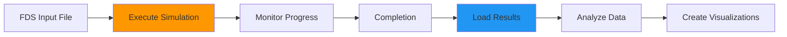

# Execution & Analysis

Learn how to run FDS simulations and analyze results using PyFDS.

## Overview

PyFDS provides a complete workflow for executing FDS simulations and analyzing the results, all from within Python.



## Guides

<div class="grid cards" markdown>

-   :material-play: **Running Simulations**

    ---

    Execute FDS simulations from Python

    [:octicons-arrow-right-24: Running Guide](running.md)

-   :material-briefcase: **Job Management**

    ---

    Monitor and control running jobs

    [:octicons-arrow-right-24: Jobs Guide](jobs.md)

-   :material-chart-line: **Results Analysis**

    ---

    Load and analyze simulation output

    [:octicons-arrow-right-24: Analysis Guide](analysis.md)

-   :material-chart-box: **Visualization**

    ---

    Create plots and visualizations

    [:octicons-arrow-right-24: Visualization Guide](visualization.md)

</div>

## Quick Examples

### Run and Analyze

```python
from pyfds import Simulation

# Create simulation
sim = Simulation(chid='test')
sim.add(Time(t_end=100.0)
sim.add(Mesh(ijk=Grid3D.of(20, 20, 10), xb=Bounds3D.of(0, 2, 0, 2, 0, 1))
sim.surface(id='FIRE', hrrpua=500.0)
sim.add(Obstruction(xb=Bounds3D.of(0.5, 1.5, 0.5, 1.5, 0, 0.1), surf_id='FIRE')
sim.device(id='TEMP', quantity='TEMPERATURE', xyz=Point3D.of(1, 1, 0.9))

# Execute and get results
results = sim.run(n_threads=4)

# Analyze
print(f"Peak HRR: {results.hrr['HRR'].max():.1f} kW")
print(f"Peak Temp: {results.devices['TEMP'].max():.1f} °C")

# Visualize
results.plot_hrr('hrr.png')
results.plot_device('TEMP', 'temperature.png')
```

### Background Execution with Monitoring

```python
import time

# Start in background
job = sim.run(wait=False, monitor=True)

# Monitor progress
while job.is_running():
    print(f"Progress: {job.progress:.1f}%")
    if job.estimated_time_remaining:
        print(f"ETA: {job.estimated_time_remaining:.0f}s")
    time.sleep(5)

# Get results when complete
results = job.get_results()
```

## Features

### Execution
- **Local execution** on your machine
- **Progress monitoring** with real-time updates
- **OpenMP threading** for multi-core parallelism
- **MPI support** for distributed computing
- **Non-blocking execution** for background jobs

### Analysis
- **Automatic CSV parsing** for HRR and device data
- **Polars DataFrames** for fast data manipulation
- **Summary statistics** for quick insights
- **Built-in plotting** for common visualizations

### Job Control
- **Status tracking** for running jobs
- **Progress estimation** with time remaining
- **Cancellation** for long-running jobs
- **Error handling** with informative messages

## Topics

| Topic | Description |
|-------|-------------|
| [Running Simulations](running.md) | How to execute FDS from Python |
| [Job Management](jobs.md) | Controlling and monitoring jobs |
| [Results Analysis](analysis.md) | Working with simulation output |
| [Visualization](visualization.md) | Creating plots and charts |

---

[Start with Running Simulations →](running.md){ .md-button .md-button--primary }
