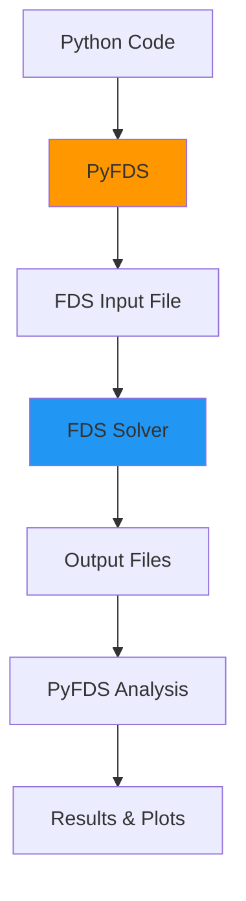

# Key Concepts

Understanding these fundamental concepts will help you use PyFDS effectively and create better fire simulations.

## FDS Fundamentals

### What is FDS?

**Fire Dynamics Simulator (FDS)** is a computational fluid dynamics (CFD) model developed by NIST for fire-driven fluid flow. FDS numerically solves the Navier-Stokes equations for low-speed, thermally-driven flows with an emphasis on smoke and heat transport from fires.

Key characteristics:

- **Large Eddy Simulation (LES)** for turbulence modeling
- **Cartesian mesh** with rectilinear geometry
- **Text-based input** files (`.fds` format)
- **Specialized for fire** scenarios

### When to Use FDS

FDS is ideal for:

✅ Building fire scenarios and smoke spread
✅ Fire protection engineering analysis
✅ Sprinkler and detector activation studies
✅ HVAC interactions with fire
✅ Wildfire modeling

FDS is **not** suited for:

❌ Non-fire fluid dynamics (use general CFD)
❌ Extremely fast reactions (explosions - use specialized tools)
❌ Solid mechanics (structural failure)
❌ Very large outdoor domains without fire

### FDS Resources

- [Official FDS Website](https://pages.nist.gov/fds-smv/)
- [FDS User Guide](https://pages.nist.gov/fds-smv/manuals.html)
- [FDS Validation Guide](https://pages.nist.gov/fds-smv/manuals.html)

---

## PyFDS Architecture

### What is PyFDS?

PyFDS is a **Python wrapper and interface** for FDS that provides:

1. **Programmatic creation** of FDS input files
2. **Validation** of simulation parameters
3. **Execution** management and monitoring
4. **Results analysis** and visualization



### PyFDS vs. Manual FDS

| Aspect | Manual FDS | PyFDS |
|--------|-----------|-------|
| **Input Creation** | Text editor, manual typing | Python code, IDE autocomplete |
| **Validation** | Run FDS to find errors | Immediate validation before running |
| **Parametric Studies** | Copy/paste/modify files | Loop over parameters in Python |
| **Data Analysis** | Manual CSV parsing | Automatic DataFrame loading |
| **Type Safety** | None (text file) | Full type hints and checking |
| **Documentation** | Separate reference | Inline docstrings |

---

## Core Concepts

### 1. Namelists

FDS input files are organized into **namelists** - groups of related parameters enclosed in `&NAME ... /`.

PyFDS provides Python classes for each namelist:

```python
from pyfds import Simulation

sim = Simulation(chid='test')

# Each method corresponds to an FDS namelist
sim.time(t_end=100)           # &TIME ... /
sim.mesh(...)                  # &MESH ... /
sim.surface(id='FIRE', ...)   # &SURF ... /
sim.obstruction(...)           # &OBST ... /
sim.device(...)                # &DEVC ... /
```

Common namelists:

| Namelist | Purpose | PyFDS Method |
|----------|---------|--------------|
| **HEAD** | Simulation metadata | `Simulation(chid=..., title=...)` |
| **TIME** | Time control | `.time()` |
| **MESH** | Computational domain | `.mesh()` |
| **SURF** | Surface properties | `.surface()` |
| **OBST** | Solid obstructions | `.obstruction()` |
| **VENT** | Boundaries and vents | `.vent()` |
| **DEVC** | Measurement devices | `.device()` |
| **MATL** | Material properties | `.material()` |
| **REAC** | Combustion reactions | `.reaction()` |

See [Namelist Reference](../reference/namelist-reference.md) for complete details.

### 2. Coordinate System

FDS uses a **Cartesian coordinate system** with bounds specified as `XB`:

```python
# XB format: (xmin, xmax, ymin, ymax, zmin, zmax)
xb = (0, 5, 0, 5, 0, 2.5)
#     ↓   ↓   ↓   ↓   ↓   ↓
#     x   x   y   y   z   z
#    min max min max min max
```

Visualization:

```
         Z (vertical)
         ↑
         |
         |___→ Y
        /
       /
      ↓
     X
```

**Units**: All dimensions in FDS are in **meters (m)**.

### 3. Mesh and Grid

The **mesh** defines the computational domain divided into cells:

```python
sim.mesh(
    ijk=(50, 50, 25),        # Number of cells in X, Y, Z
    xb=(0, 5, 0, 5, 0, 2.5)  # Physical bounds
)
```

Cell size calculation:

```python
dx = (xmax - xmin) / i  # (5 - 0) / 50 = 0.1 m
dy = (ymax - ymin) / j  # (5 - 0) / 50 = 0.1 m
dz = (zmax - zmin) / k  # (2.5 - 0) / 25 = 0.1 m
```

!!! tip "Mesh Resolution Guidelines"
    - **Coarse** (0.2-0.3m): Quick tests, large domains
    - **Medium** (0.1-0.2m): Standard room fires
    - **Fine** (0.05-0.1m): Detailed analysis, small fires
    - **Very Fine** (<0.05m): Research, validation studies

### 4. Surfaces

**Surfaces** define material properties and boundary conditions:

=== "Fire Surface"

    ```python
    sim.surface(
        id='BURNER',
        hrrpua=1000.0,      # Heat release rate per unit area (kW/m²)
        color='RED'
    )
    ```

=== "Material Surface"

    ```python
    sim.surface(
        id='CONCRETE',
        matl_id='CONCRETE',
        thickness=0.2
    )
    ```

=== "Boundary Condition"

    ```python
    sim.surface(
        id='INLET',
        vel=1.0,            # Velocity (m/s)
        tmp_front=25.0      # Temperature (°C)
    )
    ```

### 5. Geometry

Geometry is created using **obstructions** and **vents**:

```python
# Solid obstruction (wall, furniture)
sim.obstruction(
    xb=(0, 0.2, 0, 5, 0, 2.5),  # Thin wall
    surf_id='CONCRETE'
)

# Vent (opening, boundary)
sim.vent(
    xb=(4, 4, 0, 2, 0, 2),      # Door (zero thickness in X)
    surf_id='OPEN'               # Open to ambient
)
```

### 6. Devices

**Devices** measure quantities at specific locations:

```python
# Point measurement
sim.device(
    id='TEMP_1',
    quantity='TEMPERATURE',
    xyz=(2.5, 2.5, 2.4)    # Single point
)

# Area measurement
sim.device(
    id='HF_FLOOR',
    quantity='HEAT FLUX',
    xb=(0, 5, 0, 5, 0, 0)  # Entire floor
)
```

Common quantities:

- `TEMPERATURE` - Temperature (°C)
- `VELOCITY` - Flow velocity (m/s)
- `HEAT FLUX` - Heat flux (kW/m²)
- `PRESSURE` - Pressure (Pa)
- `DENSITY` - Density (kg/m³)
- Many more in [FDS User Guide](https://pages.nist.gov/fds-smv/manuals.html)

---

## PyFDS Workflow

### 1. Create Simulation

Start by creating a `Simulation` object:

```python
from pyfds import Simulation

sim = Simulation(
    chid='my_simulation',     # Case identifier (required)
    title='My Fire Test'      # Descriptive title (optional)
)
```

### 2. Configure Components

Add components using methods:

```python
# Time parameters
sim.time(t_end=600.0)

# Computational domain
sim.mesh(ijk=(50, 50, 25), xb=(0, 5, 0, 5, 0, 2.5))

# Materials and surfaces
sim.surface(id='FIRE', hrrpua=1000.0)

# Geometry
sim.obstruction(xb=(2, 3, 2, 3, 0, 0.1), surf_id='FIRE')

# Measurements
sim.device(id='TEMP', quantity='TEMPERATURE', xyz=(2.5, 2.5, 2.4))
```

### 3. Validate

Validation happens automatically, but you can explicitly check:

```python
warnings = sim.validate()
if warnings:
    for w in warnings:
        print(f"Warning: {w}")
```

### 4. Write FDS File

Generate the FDS input file:

```python
sim.write('my_simulation.fds')
```

### 5. Execute (Optional)

Run the simulation:

```python
# Blocking execution
results = sim.run(n_threads=4)

# Non-blocking execution
job = sim.run(wait=False)
while job.is_running():
    print(f"Progress: {job.progress:.1f}%")
```

### 6. Analyze Results (Optional)

Access and visualize results:

```python
# Load results
from pyfds import Results
results = Results(chid='my_simulation')

# Access data
hrr = results.hrr
devices = results.devc

# Plot
results.plot_hrr('hrr.png')
```

---

## Method Chaining

PyFDS supports **method chaining** for concise code:

```python
sim = (Simulation(chid='test')
       .time(t_end=100)
       .mesh(ijk=(20, 20, 10), xb=(0, 2, 0, 2, 0, 1))
       .surface(id='FIRE', hrrpua=500)
       .obstruction(xb=(0.5, 1.5, 0.5, 1.5, 0, 0.1), surf_id='FIRE'))
```

Each method returns `self`, allowing chaining.

---

## Validation

PyFDS provides **immediate feedback** on configuration errors:

```python
from pyfds import Simulation

sim = Simulation(chid='test')
sim.mesh(ijk=(10, 10, 10), xb=(0, 1, 0, 1, 0, 1))

# This will raise a validation error
sim.obstruction(xb=(5, 6, 0, 1, 0, 1), surf_id='FIRE')
# Error: Obstruction outside mesh bounds!
```

Validation checks include:

- Geometry inside mesh bounds
- Surface IDs exist before use
- Proper coordinate ordering
- Physical parameter ranges
- Required parameters present

See [Validation Rules](../reference/validation.md) for details.

---

## Type Safety

PyFDS uses **Pydantic** for automatic type validation:

```python
# This works
sim.mesh(ijk=(10, 10, 10), xb=(0, 1, 0, 1, 0, 1))

# This raises a type error
sim.mesh(ijk="invalid", xb=(0, 1, 0, 1, 0, 1))
# ValidationError: ijk must be tuple of 3 integers
```

Benefits:

- IDE autocomplete
- Type hints
- Runtime validation
- Better error messages

---

## Data Structures

### DataFrames with Polars

PyFDS uses **Polars** for fast, efficient data handling:

```python
results = Results(chid='test')

# Results as Polars DataFrame
hrr_df = results.hrr
print(hrr_df.head())

# Filter and analyze
peak_hrr = hrr_df['HRR'].max()
time_at_peak = hrr_df.filter(hrr_df['HRR'] == peak_hrr)['Time'][0]
```

Why Polars?

- Faster than Pandas
- Lower memory usage
- Better null handling
- Lazy evaluation

---

## Best Practices

### 1. Start Simple

Begin with coarse meshes and short times:

```python
# Quick test (runs in seconds)
sim.mesh(ijk=(10, 10, 10), xb=(0, 2, 0, 2, 0, 1))
sim.time(t_end=10.0)
```

Refine after validation:

```python
# Production run
sim.mesh(ijk=(40, 40, 20), xb=(0, 2, 0, 2, 0, 1))
sim.time(t_end=300.0)
```

### 2. Use Validation

Always validate before long runs:

```python
warnings = sim.validate()
assert len(warnings) == 0, "Fix warnings first!"
sim.write('simulation.fds')
```

### 3. Meaningful Names

Use descriptive IDs:

```python
# Good
sim.surface(id='WOOD_WALL', ...)
sim.device(id='TEMP_CEILING_CENTER', ...)

# Bad
sim.surface(id='S1', ...)
sim.device(id='D1', ...)
```

### 4. Comment Complex Logic

```python
# Create sprinkler activation logic
sim.prop(id='SPRINKLER', quantity='SPRINKLER LINK TEMPERATURE', activation_temperature=68)
sim.ctrl(id='SPRINK_CTRL', input_id='TEMP_1', setpoint=68)
```

### 5. Organize Code

Group related components:

```python
# Geometry
sim.mesh(...)
for x in range(5):
    sim.obstruction(...)  # Walls

# Fires
sim.surface(id='FIRE', ...)
sim.obstruction(..., surf_id='FIRE')

# Measurements
for i in range(10):
    sim.device(...)
```

---

## Common Patterns

### Parametric Studies

```python
for hrr in [500, 1000, 1500, 2000]:
    sim = Simulation(chid=f'fire_{hrr}')
    sim.time(t_end=300)
    sim.mesh(ijk=(30, 30, 15), xb=(0, 3, 0, 3, 0, 1.5))
    sim.surface(id='FIRE', hrrpua=hrr)
    sim.obstruction(xb=(1, 2, 1, 2, 0, 0.1), surf_id='FIRE')
    sim.write(f'fire_{hrr}.fds')
```

### Grid Convergence Studies

```python
for resolution in [0.2, 0.1, 0.05]:
    cells = int(5 / resolution)
    sim = Simulation(chid=f'grid_{resolution}')
    sim.mesh(ijk=(cells, cells, int(2.5/resolution)),
             xb=(0, 5, 0, 5, 0, 2.5))
    # ... rest of setup ...
```

### Reusable Components

```python
def create_standard_room(sim, origin=(0,0,0)):
    """Add a standard 4m x 3m x 2.5m room."""
    x0, y0, z0 = origin
    # Walls
    sim.obstruction(xb=(x0, x0+0.2, y0, y0+3, z0, z0+2.5), surf_id='WALL')
    # ... more walls ...
    return sim

sim = Simulation(chid='multi_room')
sim = create_standard_room(sim, origin=(0,0,0))
sim = create_standard_room(sim, origin=(5,0,0))
```

---

## Next Steps

Now that you understand the key concepts:

- Explore the [User Guide](../guide/index.md) for detailed feature documentation
- Study [Examples](../examples/index.md) for practical applications
- Review the [API Reference](../api/index.md) for complete method details
- Check the [FAQ](../reference/faq.md) for common questions

---

[User Guide →](../guide/index.md){ .md-button .md-button--primary }
[Examples →](../examples/index.md){ .md-button }
